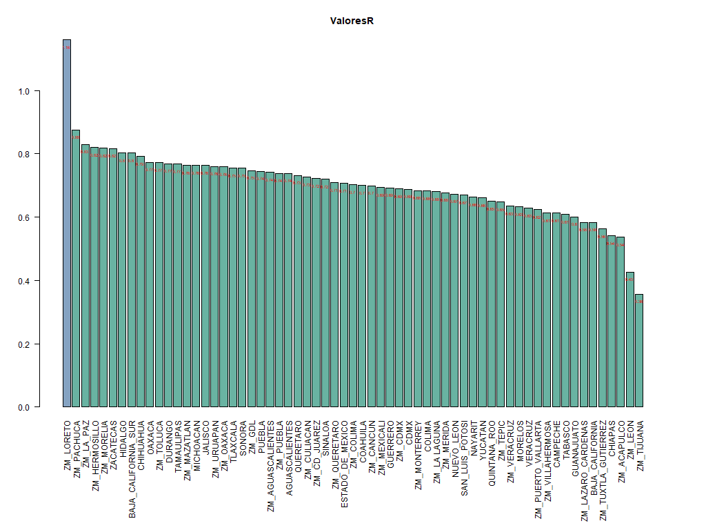

# Gráficas de crecimiento diario de covid-19 en México con R.
Los datos abiertos de covid 19 de México están disponibles en internet de manera diaria en  [Datos Abiertos covid-19  México](http://datosabiertos.salud.gob.mx/gobmx/salud/datos_abiertos/datos_abiertos_covid19.zip), sin embargo el archivo es más grande que lo que puede manejar Excel, lo que limita su uso.

Para facilitar su uso, elaboré un script en el lenguaje R que recupera el archivo diario de casos y genera gráficas y archivos csv con sumarizados, además calcula los valores del [Ritmo reproductivo básico] (https://es.wikipedia.org/wiki/Ritmo_reproductivo_b%C3%A1sico) para México, los estados y zonas metropolitanas seleccionadas de México

## Instalación de R en windows y uso del script
Para correr el script en windows se puede usar R portable

* Se instala [R portable](https://portableapps.com/node/32898)

* Se Abre el archivo "crecimientoDiario.r"
 
* Se edita la línea *mydir <-  '/Users/joaquin/Documents/Mios2020/covid/FechaIngreso-crecimientodiario'* 
 Para que aplique al directorio donde se encuentre el script, usando / como separador de directorio.

**En Linux y Mac (usando el paquete de R de la distribución),  solamente se debe instalar una vez a devtools y EpiEstim.**

## Archivos generados 

### Para el país, cada uno de los estados de México y ciudades principales se generan ocho archivos:

1. Gráfica con casos acumulados y los nuevos casos. 
 Esta gráfica está inspirada en [Ourworld in data](https://ourworldindata.org/grapher/daily-new-confirmed-cases-of-covid-19-vs-cumulative-cases-positive-rate) y permite ver claramente la tendencia actual, ya sea que se de un incremento  o disminución.
	- Archivo *Nombre-Acumvscurrent-Confirmed-New-cases-Acum-7daysAvg.png*

  

2. Curva epidémica de casos confirmados. 
 Es la curva clásica para ver la evolución de la pandemia. 
 En esta curva se ve que los fines de semana y asuetos hay menos casos que durante la semana regular.
	- Archivo *Nombre-Casos-Confirmed-New-cases-Acum-7daysAvg.png*

  

3. Gráfica de promedio móvil de 7 días de casos positivos comparado con la semana anterior.   
En la gráfica anterior es difícil ver las tendencias.
 Para la tendencia semana, se tiene la gráfica siguiente.
 Valores debajo de cero, hay una disminución de casos, valores arriba de cero, hay incremento. 
 Pude encontrar una visualización similar en [Datos de inglaterra del 9 de junio](https://www.cebm.net/covid-19/covid-19-death-data-in-england-update-9th-june) así como en la manera en que se muestran los datos económicos.
	- Archivo *Nombre-CasosVsSemAnt-Confirmed-New-cases-Acum-7daysAvg.png*

  

4. Archivo separado por comas (CSV) con los datos de las tres gráficas anteriores
	- Archivo *Nombre-Confirmed-New-cases-Acum-7daysAvg.csv*

5. Archivo CSV con los datos de mortalidad diario y promedio móvil de 7 días.
	- Archivo *Nombre-Mortality.csv*

6. Gráfica con los datos de mortalidad en un promedio móvil de 7 días.
	- Archivo *Nombre-Mortality.png*

  

7. Archivo CSV con el cálculo de ritmo reproductivo básico.
	- Archivo *Nombre-R Estimate.csv*

8. Gráfica del ritmo reproductivo básico.
	- Archivo *Nombre-R Estimate.png*
	
	
### Comparativo de estados de México y ciudades principales

1. Gráfica consolidado de los valores más recientes del ritmo reproductivo básico.
 Se puede comparar los valores más reciente de R(t) de cada estado y zona metropolitana evaluada. El valor de R(t) es un indicador temprano del crecimiento/disminución el cual es muy afectado por la tendencia de la última semana.
	- Archivo *All-R0.png*	

  

2. Reporte de los valores más recientes del ritmo reproductivo básico.
	- Archivo *All-R0.csv*

## Tablero de PowerBI.
En el directorio "Tablero" se tiene un archivo que toma la información local de México y lo muestra de manera gráfica interactiva.

## Librerías
Se utiliza el paquete [EpiEstim de R] (https://cran.r-project.org/web/packages/EpiEstim/index.html), el cual es el algoritmo más reconocido para el cálculo del valor de R.